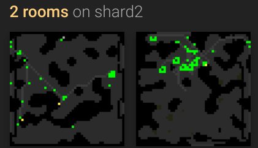
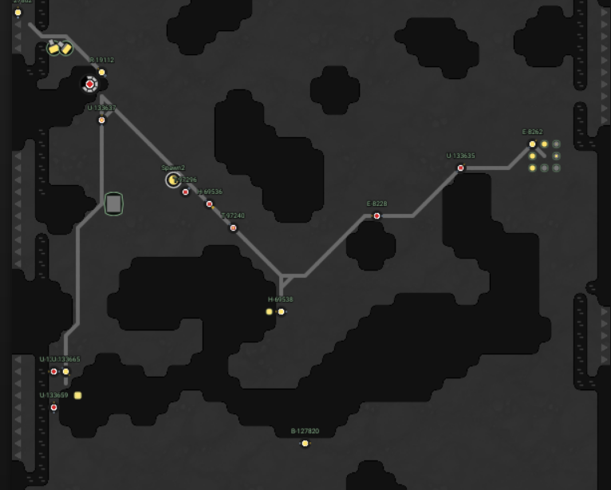
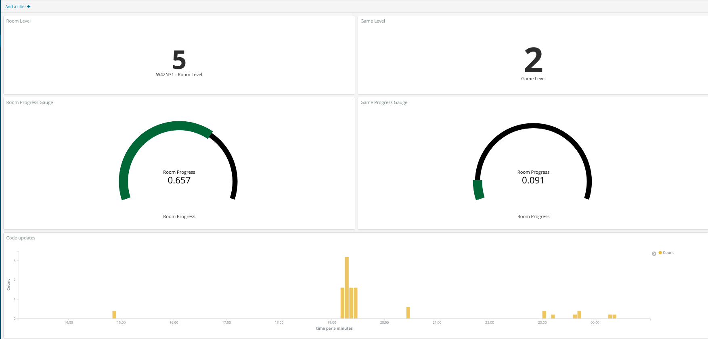

## Screeps AI

The League of Automated Roombas.

[](http://standardjs.com)
[](https://github.com/auchenberg/volkswagen)


## Description

Screeps is hard, but this AI can tackle some of the basic tasks:

- Maintaining a population of creeps to perform colony tasks like resource harvesting, construction, repair, and transport.
- Exploration of nearby territory
- Inter-room resource transport and establishing new colonies
- Room-defense
- An attempt at optimal automatic site-planning and construction
- Simple colony data-analysis via Kibana





## Extensions

There's a lot of room for improvement. Some interesting areas include:

- Memory-efficient collection of key data like energy collection rates on each transport route
- Migrate from deterministic creep-management to linear-programming based task allocation and construction
- Market-trading of any kind
- Improve generator-based building-plans from a simple computation-smearing hack to something more easily applied to other plans and rooms
- Minimum-graph cut based wall-placement
- Sentience

Apart from the AI itself, the external analytics could be improved beyond "Yet another Kibana Dashboard" too.

## Usage

```bash
yarn # or npm install

node pulpfile.js build [--watch]
node pulpfile.js console
node pulpfile.js deploy-function
node pulpfile.js download-events
node pulpfile.js index-events
node pulpfile.js lint
node pulpfile.js upload
```

## Files & Folders

- `build/commands`: a list of commands used by pulp, this project's build-system.
- `data`: contains data pulled from `screeps`.
- `dist`: code uploaded to screeps.
- `readme`: readme assets.
- `src/ai`: files used for screeps directly.
- `src/download-events`: download events from RealTime Database to a local Loki database.
- `src/save-events`: a Google Function that pulls data from Screeps into a RealTime Database.
- `src/show-events`: runs ElasticSearch / Kibana by `docker-compose.yml`, and pulls information into ElasticSearch.

## Roles

- **builder**: Seeks charge & builds nearby construction-sites.
- **harvester**: Harvest energy from a source, and transfers it to a nearby energy sink.
- **repairer**: Seeks charge & repairs nearby damaged structures.
- **scribe**: Updates the room's sign, before self-annihilating.
- **transferer**: Transfers charge from a container to an energy sink.
- **upgrader**: Either receives charge from an energy-store or harvests a source, then upgrades the controller.

## Plans

- **Exit-roads**: Build roads to each directional exit
- **Ring-roads**: Build a ring-road between spawns, sources, and containers
- **Source-containers**: Build a container by each source
- **Towers**: Place several defensive / repair towers near the controller

## Visualisations

This AI hooks into Kibana through an pull-based event-queue read from Google Functions into a Loki database. This instances tracks room & game level, energy storage, expenditure, and the room-upgrade derivative.



## License

Copyright (c) 2018 Ryan Grannell

Permission is hereby granted, free of charge, to any person obtaining a copy of this software and associated documentation files (the "Software"), to deal in the Software without restriction, including without limitation the rights to use, copy, modify, merge, publish, distribute, sublicense, and/or sell copies of the Software, and to permit persons to whom the Software is furnished to do so, subject to the following conditions:

The above copyright notice and this permission notice shall be included in all copies or substantial portions of the Software.

THE SOFTWARE IS PROVIDED "AS IS", WITHOUT WARRANTY OF ANY KIND, EXPRESS OR IMPLIED, INCLUDING BUT NOT LIMITED TO THE WARRANTIES OF MERCHANTABILITY, FITNESS FOR A PARTICULAR PURPOSE AND NONINFRINGEMENT. IN NO EVENT SHALL THE AUTHORS OR COPYRIGHT HOLDERS BE LIABLE FOR ANY CLAIM, DAMAGES OR OTHER LIABILITY, WHETHER IN AN ACTION OF CONTRACT, TORT OR OTHERWISE, ARISING FROM, OUT OF OR IN CONNECTION WITH THE SOFTWARE OR THE USE OR OTHER DEALINGS IN THE SOFTWARE.
