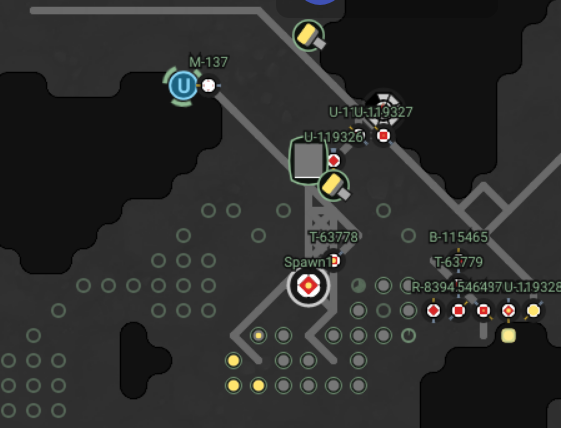

## Screeps AI

Just another Screeps AI

[](http://standardjs.com)



## Usage

```bash
yarn # or npm install

node pulpfile.js build [--watch]
node pulpfile.js console
node pulpfile.js deploy-function
node pulpfile.js lint
node pulpfile.js upload
```

## Roles

- **builder**: Seeks charge & builds nearby construction-sites.
- **harvester**: Harvest energy from a source, and transfers it to a nearby energy sink.
- **repairer**: Seeks charge & repairs nearby damaged structures.
- **scribe**: Updates the room's sign, before self-annihilating.
- **transferer**: Transfers charge from a container to an energy sink.
- **upgrader**: Either receives charge from an energy-store or harvests a source, then upgrades the controller.

## Plans

- **Exit-roads**: Build roads to each directional exit
- **Ring-roads**: Build a ring-road between spawns, sources, and containers
- **Source-containers**: Build a container by each source
- **Towers**: Place several defensive / repair towers near the controller

## License

Copyright (c) 2018 Ryan Grannell

Permission is hereby granted, free of charge, to any person obtaining a copy of this software and associated documentation files (the "Software"), to deal in the Software without restriction, including without limitation the rights to use, copy, modify, merge, publish, distribute, sublicense, and/or sell copies of the Software, and to permit persons to whom the Software is furnished to do so, subject to the following conditions:

The above copyright notice and this permission notice shall be included in all copies or substantial portions of the Software.

THE SOFTWARE IS PROVIDED "AS IS", WITHOUT WARRANTY OF ANY KIND, EXPRESS OR IMPLIED, INCLUDING BUT NOT LIMITED TO THE WARRANTIES OF MERCHANTABILITY, FITNESS FOR A PARTICULAR PURPOSE AND NONINFRINGEMENT. IN NO EVENT SHALL THE AUTHORS OR COPYRIGHT HOLDERS BE LIABLE FOR ANY CLAIM, DAMAGES OR OTHER LIABILITY, WHETHER IN AN ACTION OF CONTRACT, TORT OR OTHERWISE, ARISING FROM, OUT OF OR IN CONNECTION WITH THE SOFTWARE OR THE USE OR OTHER DEALINGS IN THE SOFTWARE.
